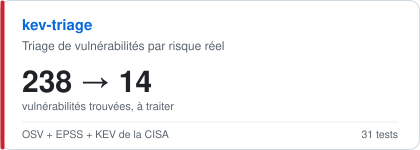
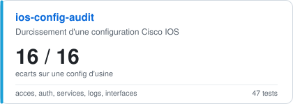
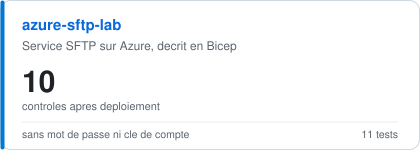
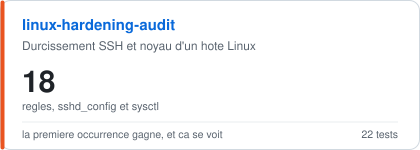
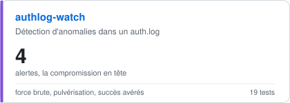
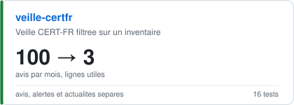

# Victor Norture

### Cybersécurité et réseaux &nbsp;-&nbsp; Bachelor 3, EFREI Paris

**Je fais tenir un flux de sécurité dans une décision courte.**

  

  

  

  

Khiplus, gestion des vulnérabilités &nbsp;-&nbsp; CGI, infrastructure Azure &nbsp;-&nbsp; Titre RNCP 40745, niveau 6 
Rugby à XV et à VII, champion d'Île-de-France à VII &nbsp;-&nbsp; Anglais B2 &nbsp;-&nbsp; Permis B

