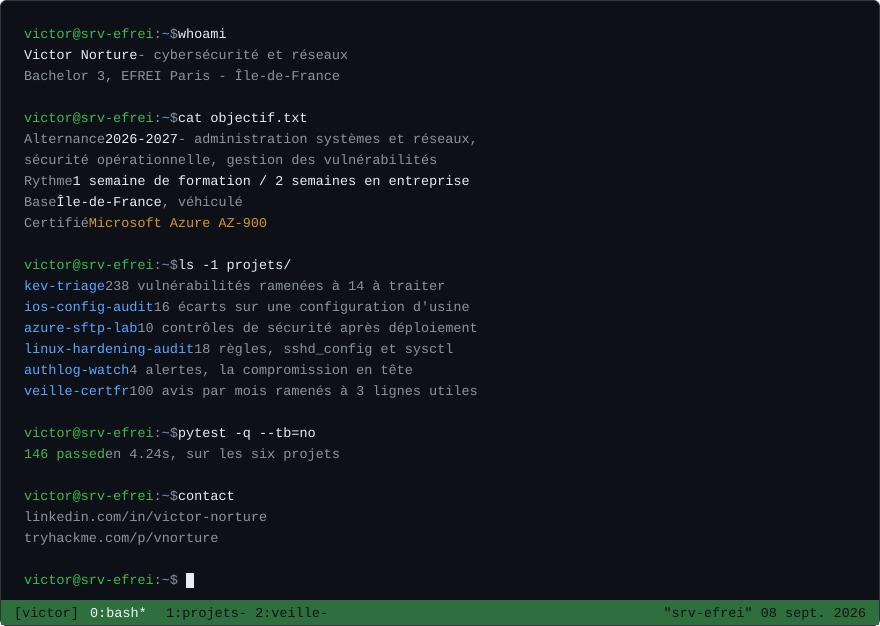

### Les projets

[**kev-triage**](https://github.com/Galax-oss/kev-triage) &nbsp;-&nbsp;
[**ios-config-audit**](https://github.com/Galax-oss/ios-config-audit) &nbsp;-&nbsp;
[**azure-sftp-lab**](https://github.com/Galax-oss/azure-sftp-lab) &nbsp;-&nbsp;
[**linux-hardening-audit**](https://github.com/Galax-oss/linux-hardening-audit) &nbsp;-&nbsp;
[**authlog-watch**](https://github.com/Galax-oss/authlog-watch) &nbsp;-&nbsp;
[**veille-certfr**](https://github.com/Galax-oss/veille-certfr)

[LinkedIn](https://www.linkedin.com/in/victor-norture) &nbsp;-&nbsp; [TryHackMe](https://tryhackme.com/p/vnorture)
